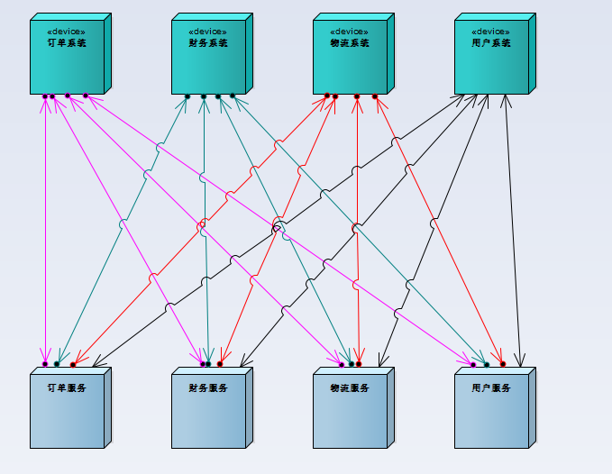
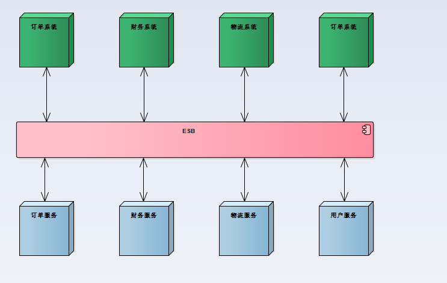

# ESB

## 传统方式

- 如图
- 
- 优点:
  - 各服务器之间通过直连方式建立连接，通讯延迟仅考虑网络，机房等客观因素
- 缺点：
  - 多个子系统直接相互交互，相互调用非常凌乱
  - 整个架构呈现网状类的架构

## ESB 方式

- 如图
- 
- 优点:
  - ESB 仅仅关心数据转发和回调
  - 服务间消息传递简单明确
- 缺点
  - 需要考虑数据转发效率，以及流量成本

---

## 支持的消息传递方式

- 简单的消息通知
  - 由某一个功能服发起请求，经由代理服转发，送达至目标服
  - 消息流向: A -> ESB -> B
- 消息确认
  - 由某一个功能服发起请求，经由代理服转发，送至目标服后，完成业务处理，告知原服操作结果
  - 消息流向: A -> ESB -> B -> ESB -> A
- 发布订阅者模式
  - 某一个功能服数据更改后，通知所有关心此数据更改的服务器
  - 消息流向: A -> ESB -> B1, B2, B3 ...
