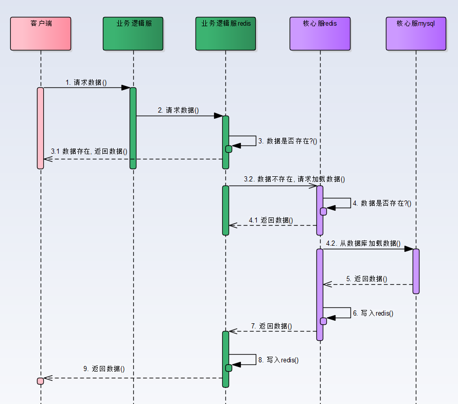
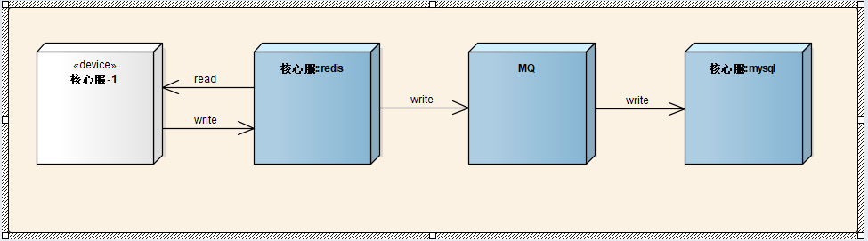

# 多级缓存最佳实现

## 1. 前提

- 这里暂不考虑 http 缓存，nginx 缓存等
- 这里讨论以 redis 做缓存为基础，当然用其他主流的方式，如 memcache

## 2. 缓存读取

- 如图
- 
- 这里做了二级缓存
  - 业务逻辑服采用 redis 做一级缓存，不存盘
  - 核心数据服采用 redis 做二级缓存，以过期时间的形式存盘，但仍以 mysql 数据为准

## 3. 缓存更新

- 方案 1：轻量级实现 - 删除更新
- 方案 2：轻量级实现 - 区分数据热度
- 方案 3：重量级实现 - redis + MQ + mysql

### 轻量级实现 - 删除更新

- 顾名思义，有数据更改，先删除 redis 缓存，然后更新 mysql
- 此时有俩种策略
  - 可以立即从 mysql 加载最新数据，缓存到 redis 中，即 hot-update
  - 也可以就此不管，等到有需要的时候在加载，即 lazy-load
- 一个问题，缓存击穿
  - 在删除这个缓存的瞬间，同时有大量的请求直接涌向核心数据服的 mysql，可能瞬间导致 mysql db 崩溃
  - 核心数据服加载数据的上层，增加一个状态 - `加载中`，若存在一个 key 的已经在加载中，则直接放入回调队列中，等到第一个请求加载完后，依次回调队列的请求
- 好处
  - 用到了`缓存预热`的思想
  - 因为核心数据服做了 redis 持久化（带过期时间），这样重启或宕机后，能够保证缓存中已有较活跃的数据，且是可信任的
- 缺点
  - 删除更新的代价太大
  - 比如用户相关信息，原来只更新用户的昵称，结果用户相关的数据全被卸载，又得重新从 DB 加载
  - 解决办法：引入数据块的加载，即业务方需要什么块的数据，只需加载对应的块，其他的块不关心则不加载

### 轻量级实现 - 区分数据热度

- `热度`
  - 热数据：频繁更新的数据，如文章点赞，文章浏览量
  - 冷数据：改动较少的数据
- 原则
  - 热数据存储到 redis，定期将数据持久化到 mysql 中
  - 冷数据储存到 mysql

### 重量级实现 - redis + MQ + mysql

- 如图
  
- 若数据同时存在 redis 和 mysql 中，则采用上述方案
  - 业务方只管将数据存入 redis 中，业务进程定期从 redis 中读取`脏数据`存入 mysql
  - 实现方案为最终一致性
- 若数据无需经过 redis，比如用户实体数据，则直接操作 mysql 即可
