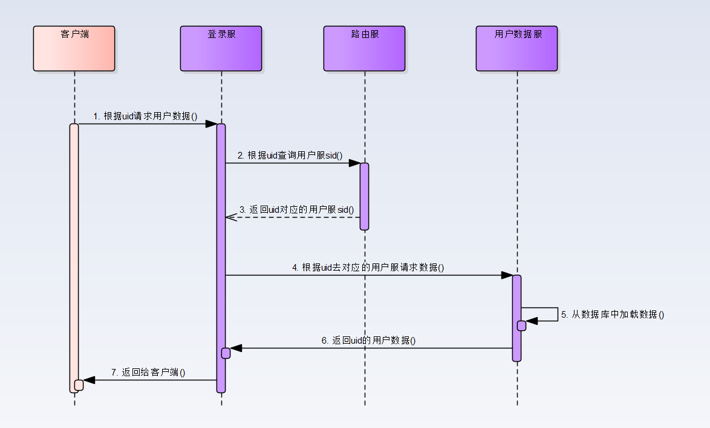

# 微服务横向扩展

## 一. 核心数据服横向扩展

### 路由服

- 核心数据服横向扩展的基础
- 核心职责: 根据路由 id 计算目标服 sid

### 用户路由服

- 根据用户 uid 计算用户数据服的 sid，明确 uid 对应的用户数据持久化的地址
- 路由算法: router_id = uid / 10000，这样，100w 用户只需要路由表维持 100 条记录即可完成

### 实例分析 - 根据 uid 记载一个用户详细信息

- 前提
  - 假定 uid 为 1000000
  - 数据持久化在用户服，服务器编号为 60001
  - 路由服中路由表有一条记录，router_id=100, user_server_id = 60001
- 实现
  - 如图，交互过程
  - 

## 二. 业务逻辑服横向扩展

- 如何保证负载均衡

### 1. nginx 负载均衡

- 通过 nginx 自带的负载均衡算法平摊所有的请求
- 缺点:
  - 仅支持 http/https/websocket 数据转发，不支持 tcp 数据转发
  - 不支持在线熔断，不支持灰度发布
- 优点：
  - nginx 自带负载均衡算法，效率较高
  - 部署简单方便

### 2. 项目方实现负载均衡

- 由一台单例的服务器，如登录总控服，记录每台逻辑服的负载情况来实现负载均衡
- 缺点：
  - 需要人工开发维护成本
- 优点：
  - 方便增加服务器性能、配置等客观因素权重
  - 支持在线逻辑服务熔断
  - 支持灰度发布

### 3. 统一 API 网关管理

- 微服务系统的入口
- 优点:
  - 负载均衡, 利用服务发现知道所有 Service 的地址和位置，通过在 API Gateway 中实现负载均衡算法
  - 接口路由，根据条件，将请求路由到正确的目的地
  - 服务熔断和服务降级
  - 灰度发布
  - 权限认证，可以在 Gateway 实现权限的认证，比如 token 认证，或者用户身份认证，这样消息在服务器间通信就可认为是可信任的
  - 安全控制, 制定特定的规则，拦截黑客的攻击
- 缺点：
  - 市面上有较多成熟的方案，暂未深入研究
